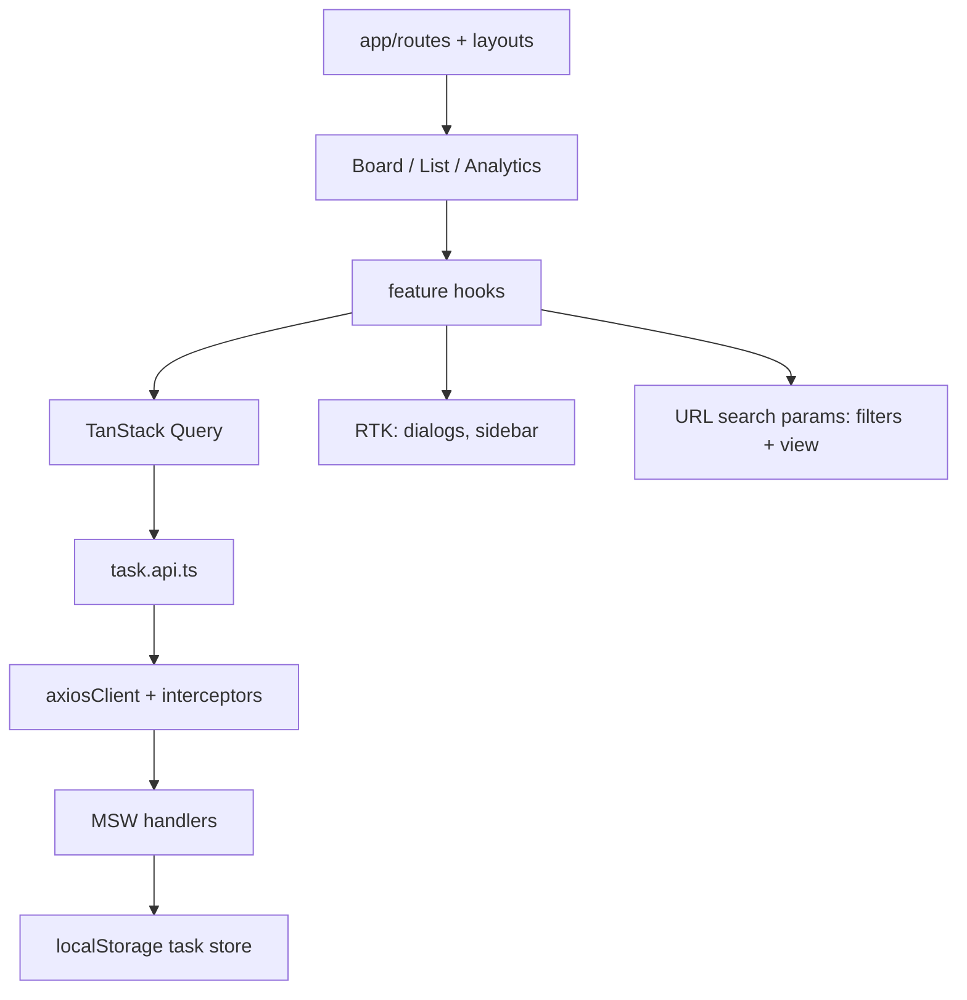

# Interactive Task & Workflow Workspace

Kanban + list task management dashboard built as a React take-home: URL-synced filters, accessible drag-and-drop, virtualized columns/list, optimistic mutations, and a live demo backed by MSW (no real backend).

**Live demo:** [https://trackprojecttasks.vercel.app/tasks](https://trackprojecttasks.vercel.app/tasks)

| Surface      | Route                                                                                                                               |
| ------------ | ----------------------------------------------------------------------------------------------------------------------------------- |
| Board / list | [`/tasks`](https://trackprojecttasks.vercel.app/tasks) · [`/tasks?view=list`](https://trackprojecttasks.vercel.app/tasks?view=list) |
| Analytics    | [`/analytics`](https://trackprojecttasks.vercel.app/analytics)                                                                      |

---

## 1. Quick Start Guide

### Prerequisites

- Node.js `^20.19.0` or `>=22.12.0` (see `.nvmrc` → `22.14.0`)
- npm 10+

### Setup

```bash
git clone https://github.com/howaida-95/track_project_tasks.git
cd track_project_tasks
cp .env.example .env
npm install
npm run dev
```

Open [http://localhost:5173](http://localhost:5173) — `/` redirects to `/tasks`.

### Environment variables

| Variable            | Default             | Purpose                                                 |
| ------------------- | ------------------- | ------------------------------------------------------- |
| `VITE_API_BASE_URL` | `/api`              | Axios + MSW base path                                   |
| `VITE_ENABLE_MOCKS` | on unless `'false'` | Start the MSW worker (required for local + Vercel demo) |

Copy from `.env.example`. Set `VITE_ENABLE_MOCKS=false` only when pointing at a real API.

### Scripts

| Command                 | Description                            |
| ----------------------- | -------------------------------------- |
| `npm run dev`           | Vite dev server                        |
| `npm run build`         | Typecheck + production build → `dist/` |
| `npm run preview`       | Serve the production build             |
| `npm run typecheck`     | `tsc -b --noEmit`                      |
| `npm run lint`          | ESLint                                 |
| `npm test`              | Vitest (watch)                         |
| `npm run test:run`      | Vitest once                            |
| `npm run test:coverage` | Vitest + coverage thresholds           |
| `npm run build:analyze` | Build with bundle visualizer           |

### Demo notes

- First visit seeds **1,200** tasks into `localStorage` via MSW.
- Deep links (e.g. `/tasks`, `/analytics`) work on Vercel via SPA rewrite in `vercel.json`.
- CI runs on PRs/`main`: install → typecheck → lint → coverage → build.

---

## 2. Architectural Decisions

### Stack choices

| Concern         | Choice                                                                                            | Why                                                                 |
| --------------- | ------------------------------------------------------------------------------------------------- | ------------------------------------------------------------------- |
| Build           | Vite + React 19 + TypeScript (`strict`, `noUncheckedIndexedAccess`, `exactOptionalPropertyTypes`) | Client-only dashboard; fast iteration; no SSR/SEO need              |
| Styling         | Tailwind v4 + shadcn/ui (Radix) + design tokens                                                   | Token-first theme; accessible primitives without owning focus traps |
| Server state    | TanStack Query v5                                                                                 | Cache, retries, cancellation, offline awareness at the right layer  |
| Client UI state | Redux Toolkit                                                                                     | Dialogs, sidebar; never holds task entities                         |
| HTTP            | axios (single client)                                                                             | Interceptors, timeout, one typed error boundary                     |
| Forms           | React Hook Form + Zod                                                                             | Shared create/edit form; schema = contract                          |
| Routing         | React Router v7                                                                                   | Layout routes, lazy chunks, URL as filter source of truth           |
| DnD             | `@dnd-kit`                                                                                        | Keyboard sensor + live-region announcements; RTL-friendly           |
| Virtualization  | `@tanstack/react-virtual`                                                                         | 1,000+ rows/cards without mounting everything                       |
| Mock API        | MSW v2 + `localStorage` store                                                                     | Same handlers for browser, tests, and the deployed demo             |

### Why Redux Toolkit _and_ TanStack Query (not RTK Query)

The brief allows either. Splitting them keeps the **server-vs-client** boundary visible: task data never lands in a Redux slice, and axios stays the only HTTP entry point (RTK Query would need a custom `axiosBaseQuery`). Collapsing onto RTK Query later is a viable team preference — listed under roadmap.

### Feature-sliced layout

```text
src/
  app/          # providers, store, routes, layouts
  features/
    tasks/      # api, model, hooks, components, views, filters, board
    analytics/  # lazy stats page consuming GET /tasks/stats
  shared/       # axios client, errors, QueryState, logger, badges
  mocks/        # MSW handlers, localStorage repository, seed
  test/         # setup, factories, renderWithProviders
```

Rule: `features/*` may import `shared/*`, not each other. Views do not call axios.

### Data flow



### API error handling — why, and where

Errors are mapped **once** at the HTTP edge so UI never sees raw `AxiosError`:

1. **`shared/api/axiosClient.ts`** — request id header; response interceptor → `TimeoutError` / `NetworkError` / `ApiError`.
2. **`parseResponse` + Zod** — contract breaks become `ApiContractError` (not retried).
3. **TanStack Query retry** — exponential backoff + jitter for network/timeout/5xx; **4xx and contract errors are never retried** (retrying a 400 only adds latency).
4. **Mutations** — optimistic patch → rollback on failure → toast with **Retry**.
5. **`reportError` logger seam** — console in dev; production hook ready for Sentry.

### Error boundaries — why, and where

| Layer         | Location                                            | Role                                                            |
| ------------- | --------------------------------------------------- | --------------------------------------------------------------- |
| Global        | `AppErrorBoundary` inside `QueryErrorResetBoundary` | Catch render failures; “Try again” resets React **and** Query   |
| Route / panel | `ErrorLayout`, `RoutePanelBoundary`                 | One broken panel must not blank the shell                       |
| Query UI      | `QueryState`                                        | Loading / error / empty / success without duplicating skeletons |

Boundaries handle **render** failures; Query + toasts handle **async** failures. Mixing them into one place either swallows recoverable fetch errors or remounts the whole app for a single failed query.

### Filters and shareable URLs

`useTaskFilters()` parses `?q=&status=&priority=&view=&sort=&order=` through Zod and writes back with `replace: true`. Board and list share `/tasks` so the toolbar does not remount when switching views. Legacy `/board` and `/list` redirect.

### Analytics

`GET /api/tasks/stats` returns catalog aggregates (`total`, `byStatus`, `byPriority`) without shipping task rows. The lazy `/analytics` route uses that endpoint only.

---

## 3. Engineering Trade-Offs (48h)

| Simplification                         | Decision                               | Cost                                                               |
| -------------------------------------- | -------------------------------------- | ------------------------------------------------------------------ |
| No real backend                        | MSW + localStorage for demo + tests    | Not multi-user; data is per-browser                                |
| RTK + Query instead of RTK Query       | Clearer state boundaries with axios    | Two libraries to learn                                             |
| Retry in Query, not `axios-retry`      | One retry policy that can drive UI     | Must keep mutation retry separate                                  |
| Listener middleware vs `redux-persist` | ~20 lines for whitelisted UI prefs     | No nested persist config                                           |
| Single `/tasks` route                  | Board/list via `?view=`                | Deep-link task modal not implemented (`paths.taskDetail` reserved) |
| Dialogs in Redux                       | Stable toolbar while editing           | Edit is not a shareable URL yet                                    |
| Virtualized board + dnd-kit            | Measured items + keyboard DnD          | More complex than “show more” fallback                             |
| Theme / density in store only          | Persistence ready; no toggle UI yet    | Dark mode not user-switchable in the chrome                        |
| Coverage branches ~72%                 | Lines/functions/statements ≥80%        | Branch threshold slightly relaxed                                  |
| No auth / i18n / assignees             | Out of scope for the brief             | Multi-tenant and localization deferred                             |
| AI-assisted implementation             | Faster delivery of boilerplate + tests | Human review for architecture and trade-offs (see below)           |

### API surface shipped

- `GET/POST /tasks`, `GET/PATCH/DELETE /tasks/:id`
- `GET /tasks/stats` — analytics aggregates
- List filters, sort, pagination pushed to the mock API (not filtered only in the UI)

---

## 4. Future Scalability & Roadmap

### Task management features

- Assignees, tags UI, comments, attachments
- Shareable deep links for a single task (`/tasks/:taskId` modal route)
- Theme + density toggles wired to existing `uiSlice`
- Richer analytics (date range, burn-down, charts)
- Stress-mode toggle and saved filter presets

### Platform & quality

- **Real API + auth** — swap MSW off (`VITE_ENABLE_MOCKS=false`); keep axios + Zod contracts
- **Sentry** — plug into `reportError` (already a single seam)
- **Playwright E2E** — board DnD, filters, CRUD smoke on preview deploys
- WebSocket / SSE for live board updates
- Server-driven pagination and search indexes
- Offline mutation queue beyond Query’s pause/resume
- Storybook for design-system components
- Optional collapse onto RTK Query if the team prefers one data library

---

## Architecture diagram (high level)

```text
┌─────────────────────────────────────────────────────────┐
│ RootLayout (sidebar, offline banner, skip link)         │
│  ├─ /tasks → BoardLayout → BoardView | ListView         │
│  │            filters (URL) · CRUD dialogs (Redux)      │
│  └─ /analytics → stats from GET /tasks/stats            │
└─────────────────────────────────────────────────────────┘
         │                              │
         ▼                              ▼
   TanStack Query                  Redux Toolkit
   (tasks, stats)               (dialogs, sidebar)
         │
         ▼
   axiosClient → MSW → localStorage store (1,200 seed)
```

---

## Testing & quality gates

- **Unit** — domain rules, Zod/pagination, Redux slices, retry policy, filter parsing
- **Integration** — RTL + MSW: CRUD, keyboard DnD, optimistic rollback, error UI
- **A11y** — `vitest-axe` on board, list, and task dialog; `eslint-plugin-jsx-a11y`
- **CI** — GitHub Actions on PR/`main` (typecheck, lint, coverage, build)
- **Git** — Conventional Commits, husky + lint-staged + commitlint, short-lived feature PRs

---

## AI usage

Cursor (Composer) assisted with:

- Scaffolding and repetitive wiring (layouts, MSW handlers, test factories)
- Drafting CI config, Vercel SPA rewrite, and README structure
- Refactors called out in PR descriptions (sidebar shell, tablet layout, analytics stats API)

Architecture choices, trade-offs, review of generated diffs, and final submission judgment remained human-led. AI was used as an accelerator, not as an unchecked author of production decisions.

---

## License

Private take-home submission — not licensed for redistribution.
